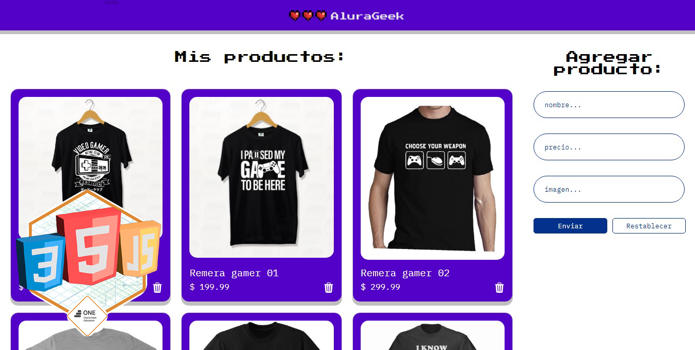

<h1>AluraGeek</h1>
Versión personal para el chanllenge de la Formanción Frontend de Alura en el marco del Programa ONE (#OracleNextEducation). El objetivo de este proyecto es poner en práctica todo lo aprendido a lo largo de la formación referente a Javascript, la manipulación del DOM, el acceso a bases de datos para extraer e ingresar información que se utilizará en la estructura de la página, como en un e-commerce.
 
<h2>Versión mobile</h2>

 
<h2>Versión desktop</h2>
